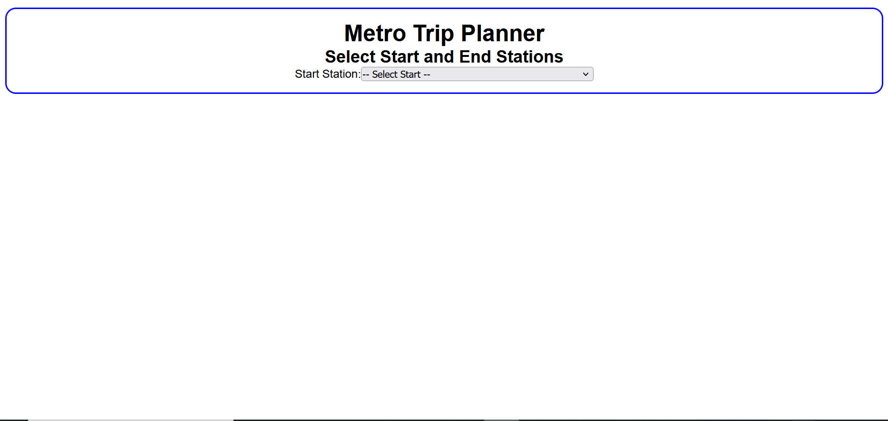

# A2 Metro Trip Planner Ash Rebelo

Express + React app

### Description: 
This website allows you to select a starting and ending metro station. After selection, an interactive map displays all the stations along the route, with markers for each one and a line connecting them. You can click on any marker to view more information about that station.
#### On Load


#### Select Start


#### Select End


#### Select Maker


## Requirements
- Metro trip planner
    - select station
        - Start Station: (can be any station)
        - End Station: (only station on the line)
    - Once a line is picked
        - Shows all the stations along the line
        - Displays a map with the line of the trip and puts the point for the stations (map code already there)
    - When selecting a point on the map
        - description of the station (from api)
        - highlight the station in the section above
- if reading the file fails -> don't start listenser
     
## Structure

There are two directories in the __root__ of the project.

* The Express server is in `server/`
* The React app is in `metro-client/
* The server responds to API calls and serves the __built__ React app.

There are 3 package.json files -- see what `scripts` they define.
<br>


## Setup

To install all the dependencies and build the React app run:

```
npm run build
```

## To run the app

### Just the client

```
cd metro-client
npm run dev
```

### Just the server

'''
cd server
node api.mjs
'''

### Client and Server


'''
cd metro-client
npm run build
cd ..
cd server
node api.mjs
'''

